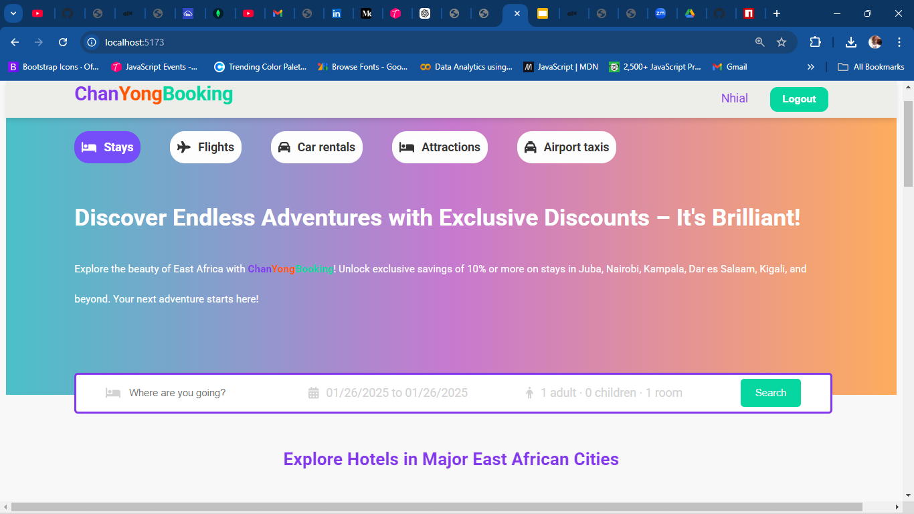
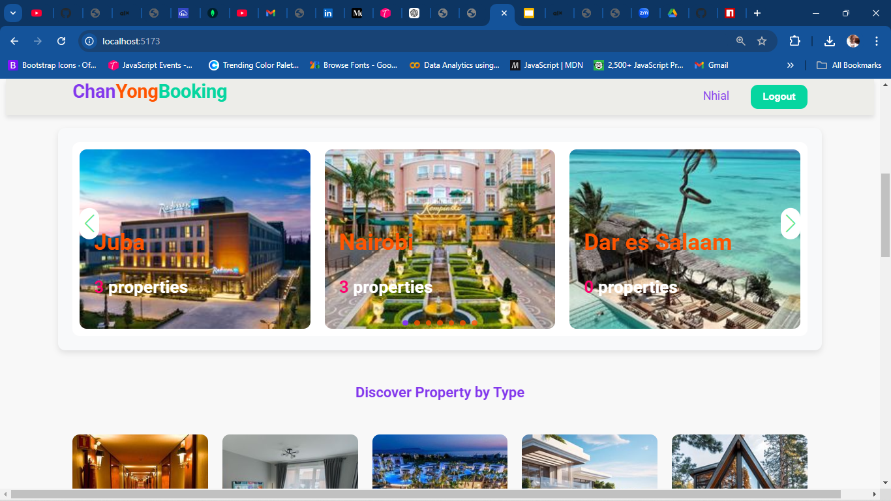
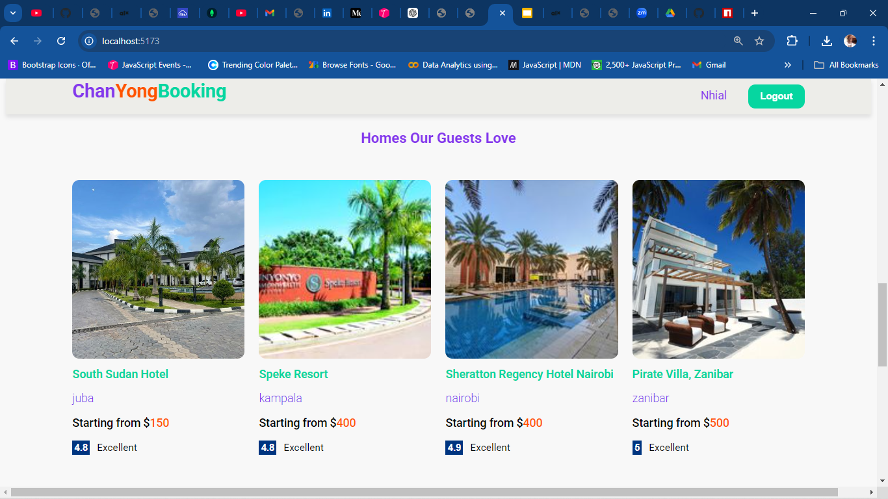
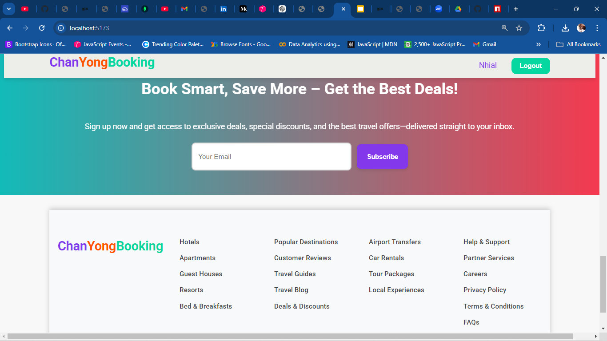
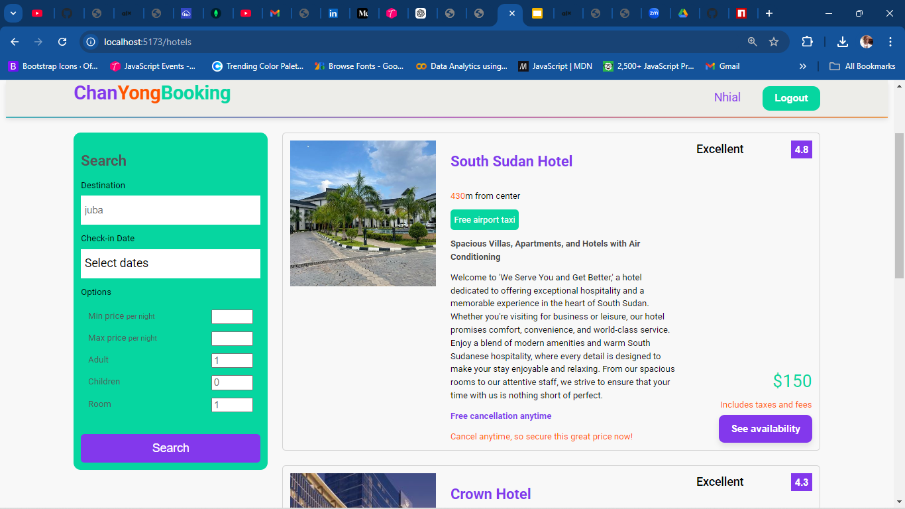
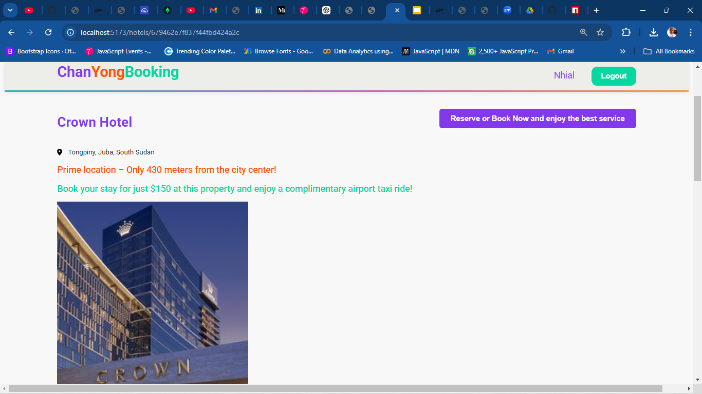
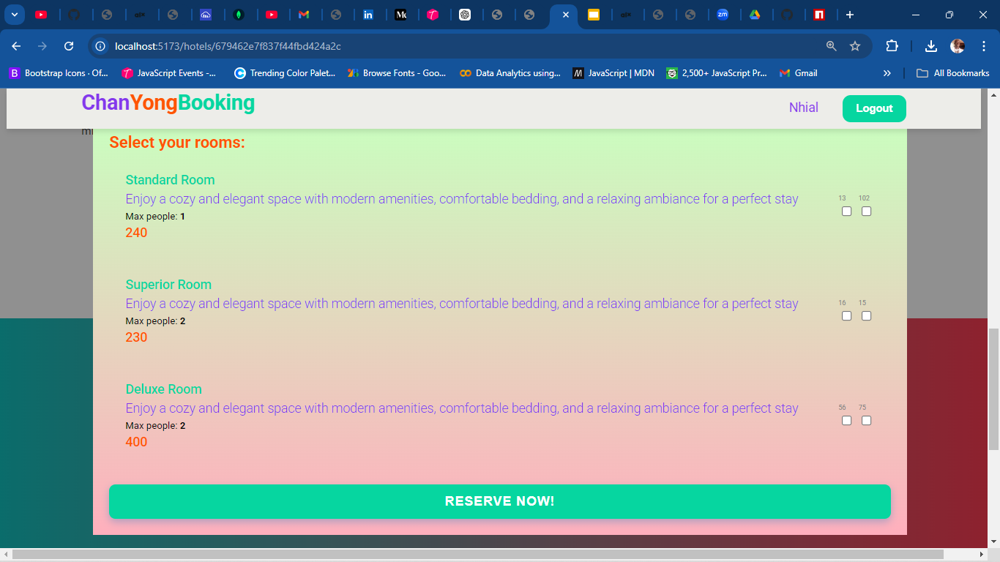

# **ChanYongBooking**

ChanYongBooking is a full-stack MERN (MongoDB, Express.js, React, Node.js) application designed for seamless hotel and accommodation booking. Users can browse, book, and manage their reservations efficiently.

---

## 🚀 **Features**
- 🏨 **Accommodation Listings** – Browse various accommodations, including hotels, villas, and apartments.
- 🔍 **Advanced Search & Filtering** – Find accommodations based on location, price, and amenities.
- 🛂 **Booking System** – Secure and intuitive booking experience.
- 👤 **User Authentication** – Sign up, log in, and manage accounts.

---

## 🫠 **Tech Stack**

### **Frontend**
- React.js (with React Router)
- React Context Hooks
- CSS for styling
- AOS for animations

### **Backend**
- Node.js
- Express.js
- MongoDB (Mongoose ORM)
- Bcryptjs for password hashing

### **Other Tools**
- JWT (JSON Web Tokens) *(for authentication, if applicable)*

---

## 🛆 **Installation**

### **1. Clone the Repository**
```bash
git clone https://github.com/Gatjuat-Wicteat-Riek/NetStatBookingApp.git
cd NetStatBookingApp
```

### **2. Install Dependencies**

#### **Backend**
```bash
cd backend
npm install
```

#### **Frontend**
```bash
cd frontend
npm install
```

### **3. Set Up Environment Variables**
Create a `.env` file in both `backend/` and `frontend/` directories and configure necessary keys like:
- MongoDB URI
- Firebase API keys
- JWT secret

### **4. Run the Project**

#### **Backend**
```bash
npm run dev
```

#### **Frontend**
```bash
npm start
```

---

## 📌 **Usage**
1. Open the application in your browser (usually at `http://localhost:3000`).
2. Browse available accommodations.
3. Select a property and proceed with booking.
4. Manage your reservations from your profile.

---

## 📂 **Project Structure**

### **Controllers**
- Auth Controller
- Hotels Controller
- Rooms Controller
- Users Controller

### **Models**
- Hotels Model
- Rooms Model
- Users Model

### **Routes**
- Auth Route
- Hotel Route
- Room Route
- User Route

---

## 🔥 **API Endpoints**

| Method | Endpoint          | Description        |
|--------|-------------------|--------------------|
| GET    | `/api/hotels`     | Get all hotels     |
| GET    | `/api/hotels/:id` | Get a single hotel |
| POST   | `/api/hotels`     | Create a hotel     |
| GET    | `/api/user`       | Get users          |
| DELETE | `/api/hotels/:id` | Delete a hotel     |

---

## ✨ **Future Improvements**
- Implement an **Admin Dashboard** for managing bookings & users.
- Integrate a **Payment Gateway** for seamless transactions.
- Enhance **SEO Optimization** for better visibility.

---

## 👍 **License**
This project is licensed under the **MIT License**.

---

## 💎 **Contact**
For any queries or contributions, reach out to:  
📩 **Gatjuat Wicteat Riek** – [gatjuatriek@gmail.com](mailto:gatjuatriek@gmail.com)

For collaborations, feel free to contact me via email.

---







